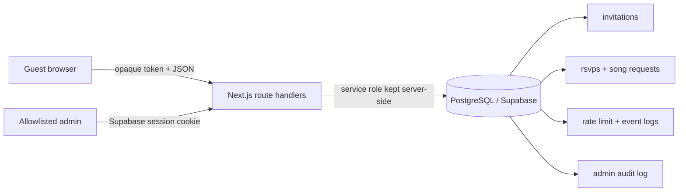
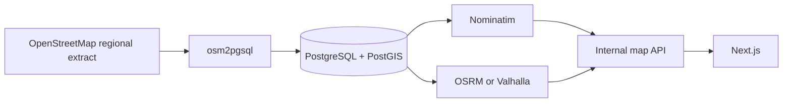

# Wedding Invitation Backend Architecture

## Scope and deployment model

The application is a private, token-addressed wedding invitation service. A guest receives one opaque, 256-bit invitation token. The database stores only its SHA-256 hash. The raw token is returned exactly once when an authorized administrator creates the invitation.

The current application uses Next.js route handlers, Supabase Auth, and PostgreSQL. It can run on the free tiers of Supabase and Vercel, but hosted Supabase and Vercel are services, not self-hosted infrastructure. A strict self-hosted deployment is described in [Open-source deployment](#open-source-deployment). Do not describe the managed deployment as fully self-hosted or permanently free: plans and limits can change.



## Data model and indexes

| Table | Purpose | Access |
| --- | --- | --- |
| `invitations` | Hashed token, personalized content, invitation limits and lifecycle state. | Service role only |
| `rsvps` | One reply per invitation with attendance and dietary notes. | Service role only |
| `song_requests` | Up to three ordered requests per invitation. | Service role only |
| `invitation_events` | Minimal first-party interaction events. No IP address or fingerprint is stored. | Service role only |
| `invitation_rate_limits` | Atomic fixed-window counters used by guest mutation endpoints. | Service role only |
| `site_settings` | Global configuration reserved for future use. | Service role only |
| `admin_audit_log` | Immutable operational record for privileged sign-in, creation, export, and deletion actions. | Service role only |

`invitations.token_hash` is unique, so token lookup is indexed by the unique constraint. `rsvps.invitation_id` and `song_requests(invitation_id, slot)` are also unique. Existing indexes support per-invitation event history and recently submitted songs. Migration `20261003000300_admin_audit_log.sql` adds indexes for audit history and resource-specific investigations.

The data model does not need Redis for a small wedding. PostgreSQL’s atomic `INSERT … ON CONFLICT … DO UPDATE` counter keeps each request limit consistent across Vercel instances. If the application grows beyond this workload, move the rate-limit key to self-hosted Valkey or Redis and use token-bucket counters there. Do not add a cache to RSVP reads without invalidation; replies are small and consistency is more useful than a cache hit.

## API contract

All invitation API responses include `Cache-Control: private, no-store` and `X-Robots-Tag: noindex, nofollow`.

| Endpoint | Success | Failure states |
| --- | --- | --- |
| `GET /api/invitation/:token` | `200` with guest-safe invitation fields | `404 not_found`, `503 service_unavailable` |
| `GET /api/invitation/:token/rsvp` | `200` with `rsvp` or `null` | `404`, `503` |
| `POST /api/invitation/:token/rsvp` | `200 { "saved": true }` | `400 invalid_request`, `403 invalid_origin`, `415 invalid_content_type`, `422 invalid_request|guest_limit`, `429 rate_limited`, `503` |
| `GET /api/invitation/:token/songs` | `200` with up to three requests | `404`, `503` |
| `POST /api/invitation/:token/songs` | `200 { "saved": true }` | `400`, `403`, `415`, `422 invalid_request|too_many_songs`, `429`, `503` |
| `POST /api/invitation/:token/open` | `200 { "recorded": true }` | `400`, `403`, `415`, `422`, `429`, `404`, `503` |
| `POST /api/invitation/:token/events` | `200 { "recorded": true }` | the same event failure codes as `/open` |
| `POST /api/admin/invitations` | `201` with the raw private URL once | `401 unauthorized`, `403 invalid_origin`, `415`, `422`, `503 audit_unavailable|service_unavailable` |
| `GET /admin/export` | `200 text/csv` | `401`, `503` |

An RSVP request has this exact shape:

```json
{
  "attendanceStatus": "yes",
  "attendeeCount": 2,
  "guestNames": ["Alex Example"],
  "dietaryRequirements": "Vegetarian",
  "notes": "Looking forward to it",
  "language": "en"
}
```

An admin invitation create request has this exact shape:

```json
{
  "displayName": "Alex & Sam",
  "groupName": "Example family",
  "language": "en",
  "maxGuests": 2,
  "plusOneAllowed": true,
  "status": "active"
}
```

The API never returns `token_hash`, service-role credentials, an invitation list to a guest, or a raw token after it has been persisted.

## Authorization and auditability

Supabase Auth issues the administrator session. `ADMIN_EMAIL_ALLOWLIST` is evaluated server-side after `auth.getUser()`. Authentication by itself is insufficient: the email must be allowlisted. The current role model is intentionally narrow:

| Capability | Guest token | Allowlisted admin |
| --- | --- | --- |
| Read one invitation and its own reply | Allowed | Allowed through dashboard service calls |
| Edit own RSVP and songs | Allowed, subject to limits | N/A |
| Create invitation URL | Denied | Allowed |
| Export guest data | Denied | Allowed |
| Delete all wedding data | Denied | Allowed with exact confirmation phrase |

This is RBAC (`guest`, `admin`) plus ABAC: each guest mutation is constrained to the invitation resolved from that token, and each reply is constrained by `max_guests` and `plus_one_allowed`. A future organizer role should be stored in an application-owned `admin_roles` table and checked by permission strings, rather than widening the email allowlist.

Every successful privileged action writes `admin_audit_log`, including sign-in/out, invitation creation, CSV export, and wedding-data deletion. A create action rolls back the new invitation if its audit entry cannot be written. The deletion audit entry is retained because the deletion function must never delete `admin_audit_log`.

## Security controls

| Risk | Control in this repository |
| --- | --- |
| Token enumeration | 32 random bytes per token, URL-safe encoding, SHA-256 storage, token format validation, generic `404`. |
| SQL injection | Supabase query builder and Zod validation; no user data is interpolated into SQL. |
| XSS | React escaping, strict schemas, no `dangerouslySetInnerHTML`, CSP. |
| CSRF | Every JSON mutation requires same-origin `Origin` or `Sec-Fetch-Site` and `application/json`; admin server actions use the authenticated Supabase session. |
| SSRF | No guest-controlled server-side URL fetching. Song links are stored as text only. |
| Brute force and write abuse | Database-backed 5 writes/minute for RSVP and songs, 20/minute for interaction events. |
| Credential leakage | Service-role key is server-only and excluded from the client bundle; `.env*` is ignored. |
| Sensitive response caching | All private API and export responses use `private, no-store`. |
| Clickjacking and MIME sniffing | CSP `frame-ancestors 'self'`, `X-Frame-Options: SAMEORIGIN`, and `X-Content-Type-Options: nosniff`. |

`next.config.ts` also sets a restrictive CSP, permissions policy, referrer policy, and cross-origin isolation headers. Spotify is the only allowed embedded third-party frame. API routes intentionally do not send `Access-Control-Allow-Origin`, so browsers cannot call them cross-origin.

## Mapping and geospatial policy

The guest site contains verified venue coordinates and opens OpenStreetMap links. It sends no map API key and uses no Google Maps or Mapbox service.

The current wedding product does not issue spatial queries, reverse-geocode an address, or calculate routes server-side. Running a routing stack for two fixed venues would add operational burden with no guest benefit. If a future multi-venue or multi-tenant product requires this capability, self-host it as follows:



Run Nominatim and OSRM or Valhalla on infrastructure you operate, restrict their APIs to your application network, import only the required regional extract, and cache immutable venue searches. This is the open-source, no-license-fee route. It still has hosting, bandwidth, maintenance, and OpenStreetMap attribution obligations.

## Open-source deployment

For a self-hosted deployment, use PostgreSQL 16 with PostGIS, Supabase self-hosted or Auth.js/Keycloak, Valkey only when the PostgreSQL rate limiter is insufficient, and a Dockerized Next.js service behind Caddy or Nginx. Back up PostgreSQL daily, encrypt backup storage, test restore quarterly, and keep the service-role secret outside application images.

For the requested managed free-tier deployment, use the Supabase project’s PostgreSQL/Auth service and Vercel’s deployment service. Before deployment, provide the required values only through the provider secret managers:

```text
NEXT_PUBLIC_SITE_URL
NEXT_PUBLIC_SUPABASE_URL
NEXT_PUBLIC_SUPABASE_ANON_KEY
SUPABASE_SERVICE_ROLE_KEY
ADMIN_EMAIL_ALLOWLIST
NEXT_PUBLIC_SPOTIFY_PLAYLIST_URL (optional)
```

Apply migrations only after linking a deliberate Supabase project:

```powershell
npx supabase login
npx supabase link --project-ref <project-ref>
npx supabase db push
```

Then deploy without committing secrets:

```powershell
vercel link
vercel env add NEXT_PUBLIC_SITE_URL production
vercel env add NEXT_PUBLIC_SUPABASE_URL production
vercel env add NEXT_PUBLIC_SUPABASE_ANON_KEY production
vercel env add SUPABASE_SERVICE_ROLE_KEY production
vercel env add ADMIN_EMAIL_ALLOWLIST production
vercel --prod
```

Create the first administrator in Supabase Auth, set its email in `ADMIN_EMAIL_ALLOWLIST`, and verify sign-in before importing any real guest data. Use a disposable project and fake invitations for the first migration and end-to-end run.

## Operational targets and fallbacks

The target for an uncached mutation is under 100 ms of application work after database connection acquisition. The network and hosted database latency are outside that bound, so measure p50/p95 separately in production. No mutation is acknowledged until PostgreSQL confirms its write. Event writes are intentionally best-effort after a successful RSVP or song request, since analytics loss must never discard the guest’s reply.

Monitor 401/403/422/429/503 response counts, database connection errors, migration state, successful RSVP count, and audit-log write failures. A `503` means the guest should retry; a `422` means the submitted data needs correction; a `429` means wait for the current limit window. Do not expose database error detail to the browser.
