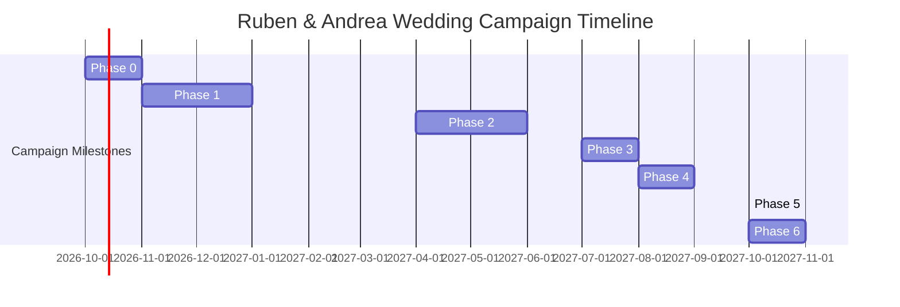

# Ruben & Andrea Wedding Platform — Comprehensive Roadmap & Market Evaluation
*Target Wedding Date: October 2, 2027 · Vienna, Austria*  
*Infrastructure Constraints: Vercel Hobby + Supabase Free + Resend Free (100% Free-Tier Architecture)*

---

## 1. Executive Summary & Market Positioning

This roadmap establishes the technical evolution and feature enhancements for the bespoke digital wedding platform of Ruben David Quijada Sanchez & Andrea Müllauer.

Unlike commercial mass-market wedding builders (Joy, Zola, The Knot) that impose rigid cookie-cutter templates, advertisements, and vendor up-sells, this platform provides a **bespoke luxury guest experience** modeled after traditional royal stationery (interactive 3D envelope, physical wax-seal crack, procedural Web Audio sound synthesis, four hand-tuned European locales including Austrian German `de-AT`, and cryptographically secured private access).

### Core Architectural Constraint: The "Free-Tier Golden Triangle"
The entire platform is engineered to run permanently on free infrastructure tiers without incurring surprise bills or operational outages:

| Platform | Free Tier Quota / Boundary | Architectural Guardrail Implemented |
|---|---|---|
| **Resend Free** | 3,000 emails/mo · **100 emails/day** hard cap | **Outbox Queue & Daily Drain:** Enforces maximum ~90 emails/day with 10 reserved for instant transactional RSVPs. Daily budget meter in `/admin/settings`. |
| **Supabase Free** | 500 MB DB · 1 GB storage · **Auto-pause after 7 days inactivity** | **Automated Keep-Alive Cron:** Daily ping via `/api/cron/keepalive` registered in `vercel.json` executing real DB queries to prevent project hibernation. Zero binary photo uploads in Postgres (all static assets optimized and hosted via Next.js CDN). |
| **Vercel Hobby** | 1 cron job / day · 10–60s function timeout · Non-commercial only | Chunked background processing, no long-lived daemon sockets (eliminated Baileys in favor of official `wa.me` links), serverless-safe execution. |
| **Spotify Web API** | Dev mode (max 5 authorized users, search rate limits) | In-memory & DB caching layer with graceful degradation to manual artist/title submission. |

---

## 2. Feature Evaluation: Implemented vs. Market Leaders

| Capability | Joy (Free) | Zola (Free) | RSVPify | Ruben & Andrea Platform (Current) | Roadmap Status / Improvement Plan |
|---|---|---|---|---|---|
| **Stationery & Visual Intro** | Generic card animations | Static pages | Static templates | **3D interactive envelope, wax seal break, procedural Web Audio** | 🌟 **Market Leader** — Preserved intact; zero design alterations needed. |
| **Multi-Language Localization** | Machine or manual EN only | English only | Paid add-on | **4 synchronized locales (`en`, `es`, `de-AT`, `hu`) with cultural nuance** | 🌟 **Market Leader** — Austrian Viennese terms (*Agape*, *Bim*, *Feststiege*) fully localized. |
| **Guest Privacy & Access** | Public search or shared password | Public search engines | Password protected | **256-bit SHA-256 hashed private tokens, neutral public gate (`/`)** | 🌟 **Market Leader** — Enumeration-resistant lookup; zero private data exposed on public URLs. |
| **Music Request Integration** | External Spotify link | External link | None | **Live Spotify Web API search with album art & deduplication** | 🌟 **Market Leader** — Up to 3 requests per guest with moderation queue. |
| **Households & RSVP Groups** | Household RSVP | Household RSVP | Individual inside groups | **Backend household model (`HouseholdSummary`, `group_name`)** | 🔄 **Phase 1 Priority** — Grouped multi-guest RSVP view in invitation form. |
| **Catering & Meal Caps** | Simple preferences | No caps | Hard caps per dish | **Enforced server-side caps (`checkMealCapAvailable()`)** | ✅ **Implemented** — Active in `POST /api/invitation/[token]/rsvp`. |
| **Segmented Email Dispatch** | Follow-up batches | Manual send | Filtered campaigns | **Resend Outbox with daily drain & quota budget meter** | ✅ **Implemented** — Hard 100/day limit guardrails active. |
| **WhatsApp Direct Outreach** | None / Manual | None | Twilio SMS ($$$) | **ToS-safe `wa.me` click-to-chat links with localized pre-fills** | ✅ **Implemented** — Replaced unmaintainable Baileys daemon with zero-ban links. |
| **Table Seating Planner** | Drag-and-drop | Drag-and-drop, PDF export | Table meal counts | **Schloss Hetzendorf seating manager (`/admin/seating`) with CSV export** | 🔄 **Phase 2 Priority** — Mobile touch drag-and-drop & dietary breakdown by table. |
| **Guest Check-In System** | None | Manual list | QR scanner + walk-ins | **Live `/admin/checkin` with instant search & attendance stats** | 🔄 **Phase 2 Priority** — Web camera BarcodeDetector / QR scanner integration. |
| **Data Resiliency & Backups** | Cloud backup | Cloud backup | Cloud backup | **1-click Full JSON/CSV Backup Center (`/admin/export`) + Supabase keepalive** | ✅ **Implemented** — Prevents Supabase auto-pause; offline local fallback sanitized. |

---

## 3. Open-Source Ecosystem Mining

| Project Reference | Key Inspiration Adopted / Planned | Architectural Realization |
|---|---|---|
| **JFrusher/Tableaux** (MIT) | Seating planner with table capacity tracking, group dragging, and CSV guest list mapping. | Adopted in `/admin/seating` and `/admin/invitations/import`. Enhanced with Austrian Palace table themes (Belvedere, Schönbrunn, Hetzendorf). |
| **RajwanYair/Wedding** (MIT) | Per-guest QR access tokens, guest timeline tracking, and dietary constraint aggregation. | Implemented in `/admin/analytics` and `/api/admin/invitations/[id]/qr`. |
| **HiEventsDev/Hi.Events** (AGPL-3.0) | Check-in capacity tracking, rapid search, and offline-safe attendance logs. | Architecture referenced for `/admin/checkin` and `app/actions/admin-checkin.ts` (independent clean-room implementation). |
| **NeedsAdjustment/korora** | Next.js + Supabase + Vercel structural conventions. | Aligns with our App Router, server actions, and optimistic UI transitions. |
| **Copstud3/wedding-invite** | Real-time organizer notifications on RSVP receipt. | Resend transactional notifications dispatched to organizer allowlist on RSVP submission. |
| **loige.co invite-code pattern** | Cryptographic token verification gate before rendering private microsite. | Implemented via SHA-256 token hashing in `lib/storage/resilient-store.ts` and `app/i/[token]/page.tsx`. |

---

## 4. 12-Month Campaign Calendar & Milestone Roadmap

With the wedding scheduled for **October 2, 2027**, key milestones are scheduled to ensure seamless guest communication within free-tier budget limits:

### Phase 0: Foundations & Free-Tier Guardrails *(Completed — October 2026)*
- [x] **Resend Outbox System:** Daily 100-email cap enforced; daily drain logic with transactional reservation (`lib/email/outbox.ts`).
- [x] **Supabase Keep-Alive:** Daily automated ping (`/api/cron/keepalive` via `vercel.json`) to eliminate the 7-day hibernation pause.
- [x] **Full Backup Center:** 1-click JSON snapshot download and CSV exports for guests, RSVPs, and seating (`/admin/export`).
- [x] **Safe WhatsApp Dispatch:** `wa.me` deep links with pre-filled multi-language text replacing unstable Baileys background daemons.
- [x] **Security Hardening:** Automatic secret stripping (`sanitizeDbForStorage`), PII scrubbing, rate-limiting on lookup actions.
- [x] **Admin Mobile Optimization:** Horizontally scrollable data tables (`admin-table-scroll-wrap`), touch-target enhancements, responsive seating grids.

### Phase 1: Save-the-Date & Guest Address Collection *(November 2026 – January 2027)*
- [ ] **Address & WhatsApp Collection Link:**
  - Lightweight public or semi-private token form allowing international guests to verify their mailing address, dietary alerts, and preferred WhatsApp numbers.
- [ ] **Household Batch Import V2:**
  - Enhanced column auto-detection (First Name, Last Name, Group/Family, Expected Headcount, Language, Plus-One Cap).
  - Validation preview with 1-click dry-run and duplicate detection.
- [ ] **Save-the-Date Email Campaign:**
  - Outbox staggered sending (~80-90 per day) across 2 days for the initial ~150 guests.

### Phase 2: Formal Invitation & RSVP Launch *(April 2027 – June 2027)*
- [ ] **Household One-Pass RSVP:**
  - Allow a primary guest (e.g. household head) to confirm or decline for every member of their group on a single screen without re-entering tokens.
- [ ] **Sub-Event Visibility (Tags / Per-Event Invitations):**
  - Configurable tags per invitation:
    - *Full Ceremony & Reception* (Altmannsdorf Church + Schloss Hetzendorf).
    - *Civil Ceremony / Intimate Dinner* (Pre-wedding family gathering).
  - Guests only see schedule items relevant to their assigned invite tags.
- [ ] **Meal Choice Selection with Live Caps:**
  - Guest selects specific entree (e.g., Viennese Tafelspitz, Imperial Vegetarian Truffle Risotto, Children's Menu) with real-time remaining capacity feedback.

### Phase 3: RSVP Deadlines & Segmented Follow-Ups *(July 2027 – August 2027)*
- [ ] **Automated Non-Responder Segmentation:**
  - One-click filter in `/admin/invitations`: "Not Opened", "Opened but Not Responded", "Confirmed without Dietary".
- [ ] **Staggered WhatsApp Follow-Up Batches:**
  - Batch generation of personalized follow-up links with deadline countdown (e.g., *"Liebe Familie, nur noch 14 Tage bis zur RSVP-Frist"*).
- [ ] **Delivery & Engagement Metrics:**
  - Status tracking (Delivered, Opened, Clicked, Bounced) via Resend webhook or polled API.

### Phase 4: Seating Chart Finalization & Final Logistics *(August 2027 – September 2027)*
- [ ] **Interactive Visual Seating Canvas:**
  - Drag-and-drop table assignment on tablet/desktop with mobile card fallback.
  - Table dietary summary chips (e.g., Table 4: 2 Vegan, 1 Gluten-Free).
  - Constraint validation (keep specific families together or apart).
- [ ] **Logistics Send-Out:**
  - Automated dispatch of final schedule, transit guide (S7, Badner Bahn / Bim 62, CAT), dress code tips, and venue entry pass.

### Phase 5: Event Day Check-In *(October 2, 2027)*
- [ ] **Multidevice Live Check-In:**
  - Web camera barcode scanner via `BarcodeDetector` / ZXing WASM for usher iPhones and Android devices.
  - Instant offline resilience with local storage caching in case of palace Wi-Fi latency.
  - Real-time venue capacity meter and table number display upon check-in.

### Phase 6: Post-Wedding & Archival *(October – November 2027)*
- [ ] **Thank-You Campaign:**
  - Personalized email dispatch to all attending guests with link to couple's photo gallery.
- [ ] **Data Retention & Privacy Clean-Up:**
  - One-click GDPR / Austrian DSGVO data wipe: anonymize guest phone numbers and dietary data while preserving guestbook wishes and song requests.

---

## 5. Architectural Quality Checklist & Verification

Every future release must satisfy the project's quality gates:

1. **Zero Secret Leaks:** Verify with `npm test` and automated tests that storage sanitization strips all API keys.
2. **Deterministic Builds:** `npm run build` must compile 100% of routes without dynamic server errors.
3. **Type Safety:** `npm run typecheck` passes with zero errors under TypeScript strict mode.
4. **Mobile Usability:** All admin tables, drawers, and form controls tested on viewport widths down to 360px.
5. **No Regressions on Guest Experience:** The 3D envelope, wax seal, Web Audio synth, and multi-language locales remain untouched and unencumbered.
